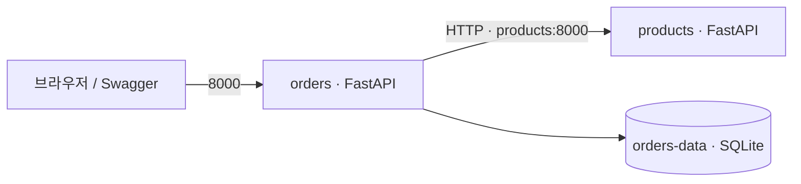
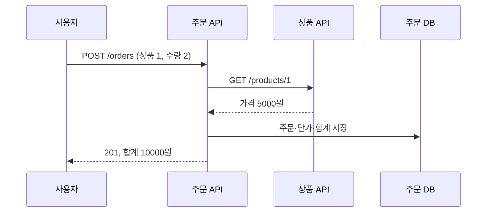

# FastAPI MSA — Docker Compose에서 EC2까지

KANT PA · 이성민 튜터 | AWS·DevOps 특강 실습

## 빠른 시작

비공개 저장소이므로 GitHub에서 접근 권한을 받은 계정으로 로그인합니다. Docker Desktop 설치 후 실행을 완료하고 Linux 컨테이너 엔진이 준비된 상태에서 진행합니다.

Windows에서 관리자 권한 승인 때문에 설치가 종료되면 설치 프로그램의 **현재 사용자용(Per-user)** 설치를 선택합니다. 이미 WSL 2가 준비된 PC에서는 관리자 권한 없이 설치할 수 있습니다. 설치 후 열려 있던 터미널을 다시 열어 `docker version`으로 Client와 Server가 모두 표시되는지 확인합니다.

```sh
gh auth login
gh repo clone SeongminJaden/aws-fastapi-msa-lab
cd aws-fastapi-msa-lab
docker compose up -d --build --wait
docker compose ps
```

브라우저에서 http://localhost:8000/docs 를 열고 `GET /products`와 `POST /orders`를 실행합니다. Docker Desktop의 Containers 화면에는 `aws-fastapi-msa-lab` 프로젝트와 `products`, `orders` 서비스가 나타납니다.

```sh
python smoke.py http://localhost:8000
docker compose logs --tail=50
docker compose down
```

`smoke.py`는 주문 한 건을 생성하는 실제 동작 검사입니다. Python이 없는 PC에서는 Swagger로 같은 검사를 할 수 있습니다. EC2에는 아래 파일 전송 방식으로 배포하면 GitHub 토큰을 서버에 저장할 필요가 없습니다. 저장소 접근 권한 없이 HTTPS clone을 시도하면 404 또는 인증 오류가 날 수 있습니다.

### 실행 검증 기록 (2026-09-21)

Windows WSL 2 · Docker Desktop 4.91.0 · Docker Engine 29.8.0 · Compose 5.5.1에서 확인했습니다.

- 이미지 빌드와 `docker compose up -d --build --wait` 성공, 두 서비스 healthy
- 실제 HTTP 상품 조회 → 주문 생성 201(10,000원) → 주문 조회 200
- 수량 0은 422, 없는 상품은 404
- 상품 컨테이너 중지 시 새 주문은 503, 기존 주문 조회는 200
- `docker compose up -d --force-recreate --wait` 후 기존 주문 보존 및 상품 조회 정상

로컬 Swagger 주소는 http://127.0.0.1:8000/docs 입니다. EC2 배포 절차는 아래에 제공하며, AWS 인스턴스에서의 실행 검증은 아직 수행하지 않았습니다.

**목표:** 상품과 주문 API를 별도 컨테이너로 실행하고, 같은 Compose 설정을 EC2에 올려 주문을 생성합니다. Python 기초와 HTTP 요청·응답을 아는 수강생을 대상으로 합니다.

## 1. 수업 구성 (60분 × 3회)

| 회차 | 개념 및 시연 | 실습 | 완료 기준 |
|---|---|---|---|
| 1 | HTTP·FastAPI·서비스 분리 15분 | 코드 읽기·Swagger 주문 생성 35분 | 201·404·422 차이를 설명합니다 (정리 10분) |
| 2 | 이미지·컨테이너·네트워크·볼륨 15분 | Compose 실행·장애·재시작 35분 | 서비스 DNS와 데이터 보존을 확인합니다 (정리 10분) |
| 3 | EC2·보안 그룹·배포 15분 | 파일 전송·실행·로그 확인 35분 | EC2 Swagger에서 주문 생성 후 정리합니다 (정리 10분) |

## 2. 무엇을 분리하나요?

온라인 문구점에서 상품 담당 팀은 상품 이름과 가격을 관리하고, 주문 담당 팀은 주문 정보를 보관합니다. 주문 팀은 상품 DB를 직접 읽지 않고 상품 API에 요청합니다.



- **상품 서비스:** 읽기 전용 상품 3개를 소유합니다. 외부 포트는 공개하지 않습니다.
- **주문 서비스:** 상품 가격을 조회하고 주문 당시의 가격을 복사해 저장합니다. 이후 상품 가격이 바뀌어도 기존 주문 금액은 유지됩니다.
- **통신:** Compose 서비스 이름 `products`가 DNS 이름입니다. 주문 컨테이너 안에서 `localhost`는 주문 컨테이너 자신입니다.
- **MSA 경계:** 프로세스·배포 단위·데이터 소유권을 나누는 실습입니다. EC2 한 대에서 실행하므로 호스트 장애는 함께 영향을 줍니다. MSA가 곧 고가용성이나 무중단 배포를 의미하지는 않습니다.



## 3. 코드 살펴보기

| 파일 | 학습 포인트 |
|---|---|
| `products/main.py` | FastAPI 경로 선언, 상품 조회, 404 |
| `orders/main.py` | Pydantic 검증, HTTP 타임아웃, 503, SQLite 트랜잭션 |
| `Dockerfile` | Python 기반 이미지, 의존성 레이어, 일반 사용자 실행 |
| `compose.yaml` | 서비스 DNS, healthcheck, 포트, 볼륨 |
| `test_api.py` | 정상·실패·재시작 검증 |
| `smoke.py` | 실제 실행 서버에 HTTP 요청하여 전체 흐름 확인 |

`quantity`는 정수 1~100만 허용합니다. 금액은 원 단위 정수이며 클라이언트가 전달한 가격을 사용하지 않습니다. 상품 API 실패 시 주문을 저장하지 않고 503을 반환합니다. `/health`는 해당 서비스 상태만 확인하며, 상품 서비스 장애 중에도 기존 주문 조회는 가능합니다.

## 4. 로컬 실행

Docker Desktop을 설치하고 실행합니다. Windows에서는 Linux 컨테이너 모드를 사용합니다. 터미널에서 **이 README가 있는 폴더**로 이동합니다.

```sh
docker version
docker compose version
docker compose config
docker compose up -d --build --wait
docker compose ps
```

`products`, `orders`가 모두 healthy이면 브라우저에서 http://localhost:8000/docs 를 엽니다.

1. `GET /products` → **Try it out → Execute**: 상품 3개가 나옵니다.
2. `POST /orders`에서 아래 JSON을 전송합니다.
3. 응답의 `id`를 복사해 `GET /orders/{order_id}`로 조회합니다.

```json
{"product_id": 1, "quantity": 2}
```

**기대 결과:** 상태 201, `unit_price: 5000`, `total: 10000`, 고유한 주문 ID.

```sh
python smoke.py
docker compose logs --tail=50 orders products
```

주문 ID를 기록한 뒤 `docker compose down`과 `docker compose up -d --wait`를 실행하고 같은 ID를 조회합니다. 명명된 볼륨 덕분에 주문이 남습니다. 상품 목록은 코드에 들어 있으므로 별도 DB가 없습니다.

### 서비스 장애 실습

```sh
docker compose stop products
# Swagger에서 새 주문 생성: 503 / 기존 주문 조회: 200
docker compose start products
# 상품 healthcheck가 정상인 것을 확인한 뒤 새 주문 생성: 201
```

`depends_on`은 시작 순서를 돕지만 실행 중 장애를 해결하지 않습니다. 타임아웃과 오류 처리가 따로 필요한 이유입니다. POST 재시도에는 중복 주문 위험이 있으므로 자동 재시도를 넣지 않았습니다.

### Docker 없이 API 검사

```sh
python -m venv .venv
# Windows PowerShell
.venv\Scripts\python -m pip install -r requirements.txt
.venv\Scripts\python -m unittest -v
# macOS/Linux에서는 위 python 경로 대신 .venv/bin/python을 사용합니다.
```

## 5. EC2 준비

실습 기준은 **Ubuntu Server 24.04 LTS, x86_64, 메모리 2 GiB 이상, EBS 12 GiB 이상**입니다. 계정별 무료 사용 조건과 현재 비용을 콘솔에서 확인합니다. 도메인·ALB·RDS는 이 실습에 필요하지 않습니다.

1. 서울 리전에서 Ubuntu 인스턴스를 만듭니다. 키 페어를 안전하게 보관합니다.
2. 인터넷 게이트웨이로 연결되는 퍼블릭 서브넷과 퍼블릭 IPv4를 사용합니다.
3. 보안 그룹 인바운드: TCP **22와 8000을 수강생 본인 공인 IP/32**에만 허용합니다. 상품 서비스 포트와 DB 포트는 열지 않습니다.
4. 기본 아웃바운드 인터넷 연결을 유지합니다. 패키지와 이미지를 내려받는 데 필요합니다.

이 예제에는 로그인·TLS가 없습니다. 실습용 데이터만 넣고, 불특정 다수에게 공개하는 운영 서비스로 사용하지 않습니다. 본인 계좌나 비밀번호 같은 실제 개인정보를 저장하지 않습니다.

## 6. EC2에 Docker 설치

로컬에서 `ssh -i "키파일.pem" ubuntu@EC2_PUBLIC_IP`로 접속합니다. macOS/Linux에서 키 권한 오류가 나면 먼저 `chmod 400 키파일.pem`을 실행합니다. 다음 명령은 **EC2 Ubuntu 셸**에서 실행합니다.

```sh
sudo apt-get update
sudo apt-get install -y ca-certificates curl
sudo install -m 0755 -d /etc/apt/keyrings
sudo curl -fsSL https://download.docker.com/linux/ubuntu/gpg -o /etc/apt/keyrings/docker.asc
sudo chmod a+r /etc/apt/keyrings/docker.asc
echo "deb [arch=$(dpkg --print-architecture) signed-by=/etc/apt/keyrings/docker.asc] https://download.docker.com/linux/ubuntu $(. /etc/os-release && echo "$VERSION_CODENAME") stable" | sudo tee /etc/apt/sources.list.d/docker.list > /dev/null
sudo apt-get update
sudo apt-get install -y docker-ce docker-ce-cli containerd.io docker-buildx-plugin docker-compose-plugin
sudo systemctl enable --now docker
sudo docker compose version
```

수업에서는 `sudo docker`를 사용합니다. Docker 그룹은 호스트의 관리자 수준 권한을 주므로 단순 권한 오류 해결 목적으로 무작정 추가하지 않습니다.

## 7. 코드 전송과 실행

**로컬 터미널**의 이 폴더에서 압축하고 전송합니다. `EC2_PUBLIC_IP`와 키 파일 경로를 실제 값으로 바꿉니다. 이 목록에는 로컬 가상환경이나 AWS 키가 포함되지 않습니다.

```sh
tar -czf fastapi-msa.tar.gz Dockerfile compose.yaml requirements.txt .dockerignore products orders smoke.py
scp -i "키파일.pem" fastapi-msa.tar.gz ubuntu@EC2_PUBLIC_IP:~/
```

**EC2 셸**에서 실행합니다.

```sh
mkdir -p ~/fastapi-msa
tar -xzf ~/fastapi-msa.tar.gz -C ~/fastapi-msa
cd ~/fastapi-msa
printf 'BIND_HOST=0.0.0.0\nAPI_PORT=8000\n' > .env
sudo docker compose config
sudo docker compose up -d --build --wait
sudo docker compose ps
python3 smoke.py http://127.0.0.1:8000
```

브라우저에서 `http://EC2_PUBLIC_IP:8000/docs`를 열어 주문을 생성합니다. EC2에서는 `.env`로 호스트 바인딩을 바꿨고, 접근 대상은 보안 그룹으로 제한합니다. 로컬 기본값은 `127.0.0.1`입니다.

## 8. 확인·수정·종료

| 증상 | 확인 및 조치 |
|---|---|
| 브라우저 연결 시간 초과 | 퍼블릭 IP, 보안 그룹 8000의 내 IP, `.env`의 BIND_HOST 확인 |
| orders가 unhealthy | `sudo docker compose logs --tail=100 orders`에서 DB 권한·기동 오류 확인 |
| 새 주문이 503 | `sudo docker compose ps`와 products 로그 확인 |
| 422 | JSON 필드와 수량 정수 1~100 확인 |
| 빌드 중 중단 | 인스턴스 메모리·디스크 여유 및 인터넷 연결 확인 |
| 수정한 코드가 반영 안 됨 | `sudo docker compose up -d --build --wait`로 이미지 재빌드 |

코드를 다시 전송·압축 해제하고 `sudo docker compose up -d --build --wait`로 갱신합니다. 이는 무중단 배포가 아니며 교체 중 잠시 요청이 실패할 수 있습니다. Docker 데몬 재기동 뒤에는 restart 정책이 적용되지만, 상품 기동이 늦으면 잠시 503이 발생할 수 있습니다.

```sh
# 컨테이너 종료, 주문 볼륨 보존
sudo docker compose down
# 실습 주문 데이터까지 삭제할 때만 실행 (복구 불가)
sudo docker compose down -v
```

수업 종료 후 EC2 콘솔에서 인스턴스를 종료하고 불필요한 EBS·스냅샷·Elastic IP가 남아 있는지 확인합니다. 컨테이너만 내리면 EC2 비용은 계속 발생하며, 인스턴스를 중지해도 남은 스토리지 등은 과금될 수 있습니다.

## 9. 제출물과 미니 퀴즈

제출: 서비스 구조 설명, EC2 `compose ps` 결과, Swagger 주문 생성·조회 결과, 재시작 후 같은 주문을 조회한 결과. 공개 자료에서는 IP와 계정 식별 정보를 가립니다.

1. 주문 서비스에서 `localhost:8000`으로 상품에 접근하면 왜 안 될까요?
2. `ports`가 없는 상품 서비스에 주문 서비스가 접근할 수 있는 이유는 무엇인가요?
3. `down`과 `down -v`의 차이는 무엇인가요?
4. 상품 장애 중 기존 주문 조회는 되는데 주문 생성은 안 되는 이유는 무엇인가요?
5. 한 EC2의 컨테이너를 둘로 나누면 EC2 장애도 격리되나요?

<details><summary>강사용 해설</summary>

1. localhost는 현재 컨테이너입니다. 서비스 DNS `products`를 사용합니다.
2. Compose 기본 네트워크 안에서는 컨테이너 포트로 통신합니다. ports는 호스트에 공개하는 설정입니다.
3. down은 명명된 볼륨을 유지하고, -v는 함께 삭제합니다.
4. 기존 주문은 주문 DB에 있고, 새 주문의 가격 조회는 상품 API에 의존합니다.
5. 아닙니다. 서비스 분리와 호스트 장애 격리는 별개의 설계입니다.

</details>

## 참고 자료

- [FastAPI 공식 Docker 배포 가이드](https://fastapi.tiangolo.com/deployment/docker/)
- [Docker 공식 Ubuntu 설치 가이드](https://docs.docker.com/engine/install/ubuntu/)
- [Docker Compose 플러그인 설치](https://docs.docker.com/compose/install/linux/)

운영 확장 과제는 인증·HTTPS, 주문 멱등성, DB 백업·PostgreSQL, 관측 지표입니다. 이 수업은 서비스 분리와 EC2에서의 실행에 집중합니다.
